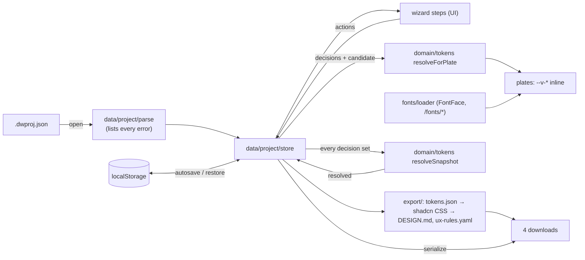

# Architecture – Design Wizard v0.1

> **Status:** proposed 2026-10-01 by architect. **Nothing is built yet.** Scope: `docs/PLAN.md`. Exact formats: `docs/CONTRACTS.md`. Agents read this page instead of scanning the repo. Update it whenever the structure changes.

## 1. System overview

This is one static page (`output: 'export'`) that runs only in the client and makes no request outside its own origin. One in-memory store holds the project file. Every view and every export is a function of that file.



- **The store is the only writer.** UI dispatches actions. The store recomputes `resolved` and autosaves. A file that fails to parse never replaces the current state.
- **`resolved` is stored, not derived on export.** It is `null` while any decision is open. A reopened file therefore re-exports byte-identically even after the palette algorithm changes. If the stored snapshot differs from a fresh computation, the user is told; it is never replaced silently.
- **Plates** get their tokens from `resolveForPlate(decisions, candidate)`. Later decisions that are still open are filled with **preview-only neutrals**, which are never stored or exported.
- **One transition for the snapshot.** Every decision action goes through the store's `transition(next, impact, label)`. While a decision is open the snapshot is parked with the strongest pending impact, and it comes back recomputed as needed when the decision closes. `store-invariants.test.ts` checks this after every action in seeded random sequences, with failing storage and frozen clocks in the mix.
- **Two times describe the durable copy** (CONTRACTS §1). `savedAt` moves only when the canonical text changes; `downloadedAt` is the last time a file on disk matched (a project-file download or an open). `fileStatus()` reads them as none, current or behind. Opening a file is undone with `undoOpen()`, which restores the previous project, both times and the autosave byte for byte until the next change.
- **Exporters are pure** (`ProjectFile → string`) and read only `profile`, `principles`, `visual` and `resolved`. tokens.json is built first. The DESIGN.md CSS block is mapped from that tokens object, never from the store.

## 2. File structure (everything under `web/`)

```
web/
├─ next.config.ts         output: 'export', images.unoptimized. Nothing else.
├─ eslint.config.mjs      import boundaries + banned APIs (§6)
├─ tsconfig.json (strict) · vitest.config.ts · playwright.config.ts · components.json (shadcn)
├─ scripts/serve-out.mjs  ~30-line node:http static server for out/: e2e on 3110, the user's daily `pnpm serve` on 127.0.0.1:3210 (no dependency)
├─ scripts/golden.mjs     `pnpm golden`: regenerates golden files on purpose. Tests never write them.
├─ public/fonts/<id>/     THE font folder: every woff2 (chrome + variants, Fontsource names) + OFL.txt
├─ fixtures/              fictional *.project.json files, shared by the contract tests and ?fixture=
├─ src/
│  ├─ contracts/          types only + schemas/*.schema.json (tokens, ux-rules). Mirrors CONTRACTS.md.
│  ├─ lib/                stable-json.ts · slug.ts · md-escape.ts · format.ts (bytes, clock time) · utils.ts (cn) (imports nothing from src)
│  ├─ content/            curated, changed by commit: laws.ts · fonts.ts (catalogue) · font-pairs.ts
│  ├─ domain/             pure TS, no React, no DOM
│  │  ├─ color/           hex.ts · contrast.ts · pairs.ts · palette.ts   (palette/contrast module)
│  │  ├─ tokens/          scales.ts · resolve.ts · plate-vars.ts
│  │  ├─ rules.ts         law + params → rendered rule; the rule count line
│  │  ├─ decisions.ts     ordered decisions (each with its stop), STOPS for J/K/E, open decisions, export gate
│  │  └─ parse-input.ts   defensive form input ("8px", "8,0", "0f766e")
│  ├─ data/project/       THE data layer: every project-file read, write and parse goes through here
│  │  ├─ parse.ts         text → ProjectFile, or every error
│  │  ├─ serialize.ts     ProjectFile → canonical bytes
│  │  ├─ migrate.ts       version switch (v1 only; the hook for v2)
│  │  ├─ empty.ts         a new project: every decision null, componentLibrary "shadcn"; isEmptyProject
│  │  ├─ store.ts         in-memory store + actions (open/undoOpen, decisions, keep/recompute, markDownloaded) + fileStatus + useProject()
│  │  ├─ storage.ts       localStorage envelope, "unsaved since", quarantine of unparseable text
│  │  ├─ file-io.ts       open (File.text), download (Blob URL, delayed revoke), downloadMany (150 ms apart)
│  │  └─ dev-fixtures.ts  ?fixture=empty|harbour|stale|invalid-many|zero-laws|behind|edge-name|snapshot-differs (development build only)
│  ├─ export/             pure: ProjectFile → file text
│  │  ├─ tokens-json.ts   DTCG 2025.10
│  │  ├─ shadcn-map.ts    role → shadcn table + CSS block. Optional layer, only when profile.componentLibrary = "shadcn"
│  │  ├─ css-vars.ts      role-named CSS block + Tailwind v4 @theme (when componentLibrary = "none")
│  │  ├─ design-md.ts     Part B markdown
│  │  ├─ ux-rules-yaml.ts YAML via its own small emitter (closed shape, byte control)
│  │  └─ index.ts         exportAll → DESIGN.md, tokens.json, ux-rules.yaml (the export step adds <slug>.dwproj.json from data/serialize)
│  ├─ fonts/              loader.ts (FontFace as "dwv-<id>", cache, document.fonts.load) · use-font-pair.ts
│  ├─ app/                layout.tsx (CSP meta, chrome fonts) · page.tsx (the only route) · fonts.ts (next/font/local) · globals.css (chrome tokens + shadcn theme)
│  └─ components/
│     ├─ ui/              shadcn primitives, chrome theme only
│     ├─ wizard/          WizardShell · Rail · ShortcutLegend · use-shortcuts · ContrastTable · LivePreview · preview-candidate ·
│     │                   SnapshotNotice · OpenedNotice · OpenProjectButton · SubDecisionList · ArrowText · classes (shared button classes)
│     │  └─ steps/        profile · principles · visual/{font-pair,spacing,radius,palette,density} · preview · export/ExportStep
│     ├─ plate/           Plate (crop marks, brackets, fixed size, loading/failed) · PlateGrid (radiogroup, 1/2/3) · demo-vars (DiffPins is planned for v0.2. Samples already carry data-v-part.)
│     └─ samples/         SampleCard · SampleScreen · samples.module.css. These read only --v-*.
└─ tests/
   ├─ unit/               domain, data, content catalogue, sample-isolation scan
   ├─ contract/           c1…c6 *.test.ts + golden/<fixture>/{DESIGN.md,tokens.json,ux-rules.yaml}
   └─ e2e/                keyboard flow (1280 + 390), zero external requests, plate leak, font 404
```

Repo-level changes in slice 1: `.gitignore` gets `*.dwproj.json`. A new `.gitattributes` sets `eol=lf` for `web/fixtures/**` and `web/tests/contract/golden/**`, because a CRLF checkout on Windows breaks byte equality.

## 3. Layers and imports (no cycles)

| Layer | May import | Never |
|---|---|---|
| `contracts`, `lib` | nothing in `src` | – |
| `content` | contracts | anything else |
| `domain` | contracts, content, lib | React, DOM globals, data, export |
| `export` | contracts, domain, lib | **content** (reads `resolved` only), React, DOM |
| `data` | contracts, content, domain, lib | export, components |
| `fonts` | contracts, content | domain, data |
| `components/samples` | react, its CSS module | everything else, Tailwind classes, shadcn |
| `components`, `app` | all of the above | – |

These rules are enforced by `import/no-restricted-paths` zones and `import/no-cycle`. eslint-plugin-import already ships with eslint-config-next, so no new dependency is needed. `src` never imports `tests/` or `fixtures/`. The one exception is `dev-fixtures.ts`, which uses a dynamic import behind `NODE_ENV === 'development'`.

## 4. One owner per calculation (TypeScript only; nothing is computed in two languages)

| Calculation | Owner | Used by |
|---|---|---|
| Hex parse and normalise | `domain/color/hex.ts` | brand input, parser, palette |
| WCAG luminance, ratio, PASS rule, ratio formatting | `domain/color/contrast.ts` | ContrastTable, palette, design-md exporter, C4 |
| Which pairs are checked, with which threshold | `domain/color/pairs.ts` | same as above, plus the export gate |
| Brand → 3 AA-passing palettes, plus fix suggestion (Q3) | `domain/color/palette.ts` | palette step, resolve |
| Density/spacing base → type, line-height and space scales | `domain/tokens/scales.ts` | resolve |
| Decisions → `resolved`; decisions + candidate → plate tokens | `domain/tokens/resolve.ts` | store, plates, preview |
| Tokens → `--v-*` custom properties | `domain/tokens/plate-vars.ts` | Plate, SampleScreen |
| Role → shadcn variable, and the shadcn CSS block | `export/shadcn-map.ts` (one const table) | DESIGN.md table + CSS block, C4 |
| Role-named CSS block (no shadcn) | `export/css-vars.ts` | DESIGN.md CSS block, C4 |
| Law + params → rule text and check | `domain/rules.ts` | resolve (`resolved.rules`), principles step |
| Open decisions, progress, export gate, the stop that reopens each | `domain/decisions.ts` | Rail, ExportStep, export/design-md, export/tokens-json |
| Rule count line ("4 RULES · 3 MUST · 1 SHOULD") | `domain/rules.ts` | principles step, ExportStep |
| File status (none, current, behind), Undo open | `data/project/store.ts` | ExportStep bar, OpenedNotice |
| Is the project untouched | `data/project/empty.ts` | OpenedNotice (replaced-work warning) |
| UTF-8 byte length, byte and clock-time formatting | `lib/format.ts` | ExportStep |
| Count of `open: design-lead` items in DESIGN.md | `export/design-md.ts` | ExportStep |
| Secondary button classes | `components/wizard/classes.ts` | ExportStep, OpenedNotice, OpenProjectButton |
| Project-file validation | `data/project/parse.ts` | open, restore, C6 |
| Canonical JSON bytes | `lib/stable-json.ts` | serialize, tokens-json |
| Download file names | `lib/slug.ts` | export/index (`projectFileName`), design-md provenance line |

Tests call these owners. The only independent re-implementation is a set of hand-computed contrast anchors in `tests/unit` (for example `#777777` on `#FFFFFF` = 4.47), which keep `contrast.ts` honest.

## 5. Fonts: one copy per file

- **Single source:** `web/public/fonts/<family-id>/`. It holds the Fontsource latin woff2 files under their original names, plus `OFL.txt` (the copyright line + the full OFL 1.1 text) for each family. This covers the chrome families (`geist`, `ibm-plex-mono`) and every catalogue family.
- **Chrome:** `src/app/fonts.ts` calls `next/font/local` with `src: '../../public/fonts/geist/…'`. The build emits its own hashed copy; the repo keeps one.
- **Variants:** `fonts/loader.ts` builds `/fonts/<id>/<file>` from `content/fonts.ts` and loads only the weights the pair names. It registers each face as `"dwv-<id>"`, so a variant face can never match a chrome `font-family`.
- **`design/directions/fonts/` stays** as the frozen mock's own copy. The two HTML records open standalone over `file://` with relative URLs. Nothing in `web/` reads `design/`, and the folder is never updated. Its drift is intended, because it is a dated record.
- **Catalogue test (`tests/unit`):** every listed file exists, and every family folder has `OFL.txt` and `license: "OFL-1.1"`. No woff2 is unlisted, and every pair's weights exist as files.

## 6. Boundaries and how each one is enforced

| Boundary | Enforced by |
|---|---|
| No server code | **Build:** with `output: 'export'`, `next build` fails on server actions, middleware, request-dependent route handlers and image optimisation. **Lint:** `no-restricted-imports` bans `next/headers`, `next/server` and `server-only`; there is no `src/app/api/`. |
| No third-party requests | **Lint:** bans `next/font/google`, and `no-restricted-globals` bans `fetch`, `XMLHttpRequest`, `WebSocket`, `EventSource` and `sendBeacon` (the app needs none of them). **Runtime:** a CSP `<meta>` in `layout.tsx`: `default-src 'self'; script-src 'self' 'unsafe-inline'` (+ `'unsafe-eval'` in dev only); `style-src 'self' 'unsafe-inline'; font-src 'self'; img-src 'self' data: blob:; connect-src 'self'; object-src 'none'; base-uri 'none'; form-action 'none'`. **e2e:** every request against the built `out/` is recorded, and any host other than localhost fails the run (acceptance 2). If the meta CSP breaks dev HMR, it is applied to production builds only; the e2e audit is the acceptance check. |
| Samples read only `--v-*` | **Unit `sample-isolation`:** scans `components/samples/`. Every `var(--…)` must start with `--v-`. There may be no colour literal (hex, rgb, hsl, oklch or a named colour other than `transparent`/`currentColor`), no `font-family` other than `var(--v-font-*)`, and no `className="…"` string (CSS module only). **CSS:** the chrome's global base rules (shadcn's `* { border-color; outline }`) are scoped with `:not([data-v-root] *)`. **e2e:** the leak test (acceptance 4). |
| Variants never reach the chrome | `--v-*` is set inline on the plate root only, and faces are named `dwv-*`. **e2e:** the chrome's computed font-family and colours are unchanged after a variant changes. |
| Exports are byte-stable | `lib/stable-json`, LF only, no timestamps. **C1/C2** goldens and `.gitattributes`. |

## 7. Commands (planned; run from `web/`)

| Command | Does |
|---|---|
| `pnpm dev` | `next dev` (the user runs it on 3000; agents use run-web on 3110) |
| `pnpm build` | `next build` → static `out/` |
| `pnpm lint` · `pnpm typecheck` | ESLint · `tsc --noEmit` |
| `pnpm test` | Vitest: `tests/unit` + `tests/contract` |
| `pnpm e2e` | Playwright. Its `webServer` runs `node scripts/serve-out.mjs --port 3110` on an existing `out/` and fails with "run pnpm build first" if it is missing. `reuseExistingServer: false`, so an occupied port 3110 fails loudly. |
| `pnpm golden` | Regenerates the golden files; the diff is reviewed in the commit |
| `pnpm serve` | The user's daily instance: `next build`, then `serve-out.mjs --port 3210 --host 127.0.0.1`. Agents don't run it. |

**run-web: dev mode only.** `serve.ps1 -Mode prod` calls `next start`, which does not serve `output: 'export'`. Screenshot a state with `--path "/?fixture=harbour&step=visual.palette"`. Slice 1 also removes `DEV_TODAY` and the stale Supabase line from `SKILL.md`. Next ≥ 16 keeps dev output in `.next/dev`, so `pnpm build` does not clobber the user's dev server; verify this in slice 1, step 1.

**Env vars and scheduled jobs: none.** The app reads no environment variable and has no workflow, so there is no `check-config`. `.env.example` says "no variables". If hosting is added later, `check-config` arrives with the first workflow.

## 8. Decisions on the open questions (user, 2026-10-01)

| # | Decision | Where it lands |
|---|---|---|
| 1 | Light theme only. `deep` stays as a **project palette option** (the project's palette, not the wizard's theme) | `resolved.color.dark` is `null` in v1. `palette.ts` offers quiet / tinted / deep |
| 2 | Default target is Next.js + Tailwind v4 + shadcn/ui. tokens.json stays stack-agnostic, and **shadcn is an optional export layer** | `profile.componentLibrary` (`"shadcn"` default, or `"none"`). `export/shadcn-map.ts` runs only for shadcn; `export/css-vars.ts` handles the rest (CONTRACTS §4.2 and §4.2a) |
| 3 | **"Apply fix" is cut.** Only passing palettes are offered, and ratios are shown | `palette.ts` filters to passing palettes. `visual.colorOverrides` stays `{}`. There is no `F` key |
| 4 | Generic sample screen | One generic sample in `components/samples/` |
| 5 | The project file is committed in the target repo's `design/` folder | The provenance line in `design-md.ts` names `design/<slug>.dwproj.json`, and the export step says so |
| 6 | The user approves the lists of laws and fonts, shown **as side-by-side previews** where possible | design-lead drafts `content/laws.ts`, `content/fonts.ts` and `content/font-pairs.ts` in slice 2 and presents them as previews before they are committed |
| 7 | **Diff pins are cut from v0.1,** planned for v0.2 | No `DiffPins` in v0.1. Samples still carry `data-v-part` so pins can be anchored later |
